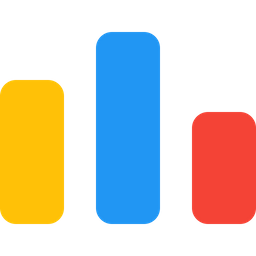
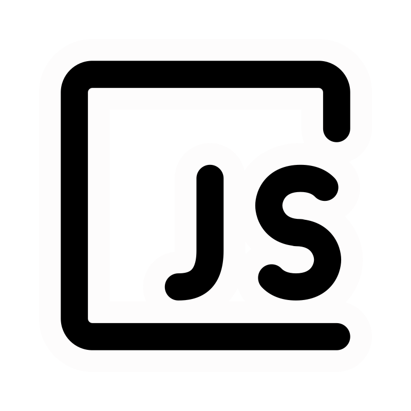

## I am a Newbie Programmer and Web Developer!

| **My Works** |
| :--- |
| [My Portfolio](https://samiulislam.dev)
| [Calculator Project](https://github.com/soumik-prime/Calculator-Project) 
| [Programming Hero Tasks](https://ph-tasks.samiulislam.dev/)
| [Cse Fest 2025](https://cse-fest.shu.edu.bd/)
| [Tic Tac Toe](https://github.com/soumik-prime/tic-tac-toe)
| [Coming Soon...](#) 

## ICPC Onsite Count - 1
1. Asia Dhaka Regional Contest 2024
   - Team: Singularity
   - Position: 50th
  
## IUPC Onsite Count - 3
1. UIU Inter-University Programming Contest 2025
   - Team: Singularity
   - Position: 108th
2. AUST Inter-University Programming Contest 2025
   - Team: Singularity
   - Position: 87th
3. NEU Mymensingh Regional IUPC 2025
   - Team: Singularity
   - Position: Champion

## Contact me:
|**Social** |  |  | |
| :--- | :---: | :--- | :--- |

| **Virtual Judge** |   |     |     |   |
| :--- | :---: | :--- | :--- | :--- |

##
| **Programming Language** |    |
| :--- | :--- | 
| **Web Development** |     |

##

##

