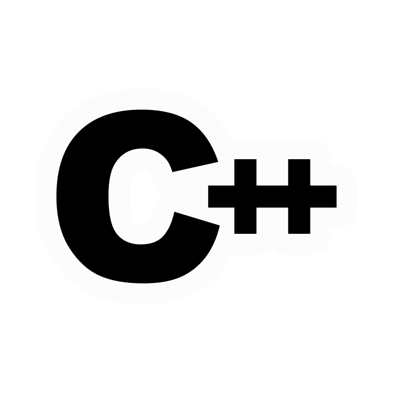

#### Hello there, I'm Md. Samiul Islam Soumik

## I am a Newbie Programmer!

- Tech Enthusiast
- Enjoys Coding
- Aspiring Programmer
- Aspiring Web Developer

## Goals to Achieve Before the End of the First Year:
❖ Become a specialist on Codeforces      
❖ Develop my portfolio website independently

#### Contact me:

#### Programming:
</a>
</a>
</a>
<!-- </a> -->

#### Web Development:
</a>
</a>
</a>

<!-- #### Works
- Assignment 01
- Assignment 02 -->

<a herf="https://github.com/soumik-prime">##soumik-prime</a>
 

<a herf="https://github.com/soumik-web">##soumik-web</a>
 

