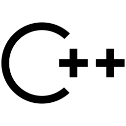

## I am a Newbie Programmer and Web Developer!

| **Programming Works** | **My Web Works** |
| :--- | :--- |
| [Calculator Project](https://github.com/soumik-prime/Calculator-Project) | [Programming Hero Tasks](https://soumik-ph-tasks.netlify.app/)
| [Coming Soon...](#) | [My Portfolio](https://md-samiul-islam-soumik.netlify.app/)

## Contact me:
|**Social** |  |  | |
| :--- | :---: | :--- | :--- |

| **Virtual Judge** |   |     |     |   |
| :--- | :---: | :--- | :--- | :--- |

##
| **Programming Language** |    |
| :--- | :--- | 
| **Web Development** |    |
| **Github Stats** |  |

